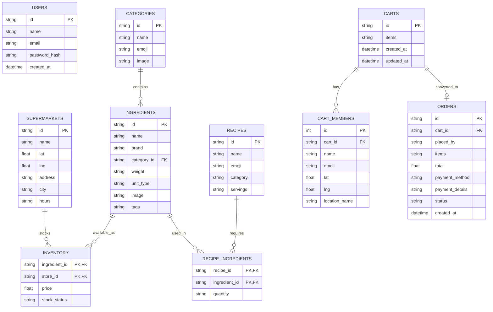

# Cook Mode: Full-Stack Architecture

This document describes the complete backend-supported architecture for the Cook Mode platform, designed as a full-stack Capstone Project. It transitions the original front-end-heavy application into a scalable, robust, data-driven application using Node.js, Express, and SQLite.

## System Overview

The system is composed of three main layers:

1. **Frontend**: HTML/CSS/JS application providing Recipe Discovery, Cook Mode UI, servings adjustments, and Shopping List generation.
2. **Backend API**: A Node.js/Express RESTful API that handles business logic, including recipe retrieval, ingredient-to-inventory matching, and cart management.
3. **Database**: A SQLite database storing persistent data (Recipes, Ingredients, Supermarkets, Inventory, Users).

---

## Entity Relationship Diagram (ERD)

The following Mermaid diagram maps out the relationships between the database tables.

## API Endpoint Specifications

Below are the suggested REST API endpoints for the capstone project.

### Recipes
*   `GET /api/recipes`
    *   **Description**: Fetch a list of all recipes.
    *   **Query Params**: `?category=Kazakh Cuisine`, `?search=plov`
*   `GET /api/recipes/:id`
    *   **Description**: Fetch a single recipe by ID, fully populated with its ingredients.

### Ingredients & Categories
*   `GET /api/categories`
    *   **Description**: Returns all categories (including `grains`).
*   `GET /api/ingredients`
    *   **Description**: Fetch ingredients.
    *   **Query Params**: `?category_id=grains`, `?search=rice`

### Stores & Inventory
*   `GET /api/supermarkets`
    *   **Description**: List all supermarkets, optionally filtered by proximity (`?lat=x&lng=y`).
*   `GET /api/inventory`
    *   **Description**: Lookup stock and pricing for specific ingredients across stores.
    *   **Query Params**: `?ingredient_ids=g001,g002,p012`

### Shopping Lists (Carts)
*   `POST /api/carts`
    *   **Description**: Create a new collaborative shopping cart.
*   `GET /api/carts/:id`
    *   **Description**: Retrieve a shopping cart and its members.
*   `PUT /api/carts/:id/items`
    *   **Description**: Update the items (ingredients) in a specific cart.

### Orders
*   `POST /api/orders`
    *   **Description**: Convert a cart into a confirmed order.
    *   **Payload**: `{ "cart_id": "SC-123", "placed_by": "User1", "payment_method": "card" }`
